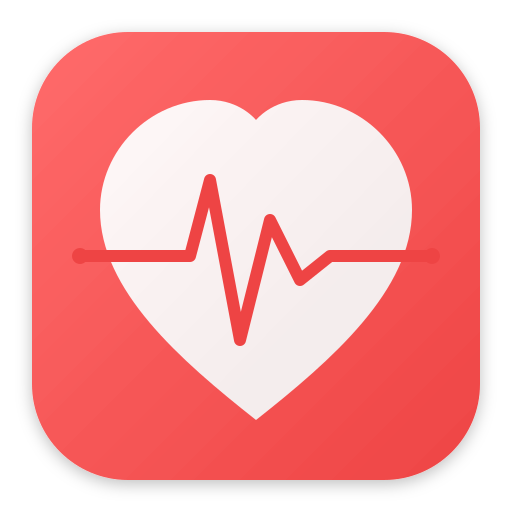

# BPM - Kan Basıncı İzleme Analiz Aracı

<p align="center">
  
</p>

<p align="center">
  <strong>Hasta verilerinizden kan basıncı değişkenlik paternlerini analiz edin</strong>
</p>

<p align="center">
  <a href="#klinisyenler-için">Klinisyenler İçin</a> •
  <a href="#veri-giriş-personeli-için">Veri Giriş Personeli İçin</a> •
  <a href="#kurulum">Kurulum</a> •
  <a href="#teknik-detaylar">Teknik Detaylar</a>
</p>

---

## Bu Uygulama Ne Yapar?

BPM, kardiyologların ve sağlık profesyonellerinin **kan basıncı değişkenliğini** analiz etmesine yardımcı olur - basit ortalama KB değerlerinin ötesine geçen önemli bir klinik belirteç.

### Çözdüğü Problem

Geleneksel KB analizi yalnızca ortalamalara bakar. Ancak araştırmalar, **kan basıncının ne kadar dalgalandığının** (değişkenlik) kardiyovasküler riski tahmin etmek için eşit derecede önemli olduğunu göstermektedir. Bu değişkenlik metriklerini Excel tablolarından manuel olarak hesaplamak:

- Zaman alıcıdır (özellikle 1000+ hasta için)
- Hata yapma olasılığı yüksektir
- İstatistiksel uzmanlık gerektirir

### Çözüm

BPM, tüm klinik açıdan önemli KB değişkenlik metriklerini Excel verilerinizden saniyeler içinde otomatik olarak hesaplar - herkesin kullanabileceği basit bir sürükle-bırak arayüzüyle.

---

## Klinisyenler İçin

### BPM Hangi Metrikleri Hesaplar?

| Metrik | Ne Ölçer | Neden Önemli |
|--------|----------|--------------|
| **Ortalama SKB/DKB** | Ortalama kan basıncı | Temel KB seviyesi |
| **SS (Standart Sapma)** | Ölçümlerin ne kadar dağınık olduğu | Genel değişkenlik |
| **DK (Değişim Katsayısı)** | Ortalamaya göre normalleştirilmiş SS (%) | Hastalar arası değişkenlik karşılaştırması |
| **OGD (Ortalama Gerçek Değişkenlik)** | Ardışık ölçümler arasındaki ortalama değişim | Kısa vadeli dalgalanmalar |
| **Ağırlıklı SS** | Saatlere göre ağırlıklandırılmış gündüz/gece SS | Düşüş artefaktını ortadan kaldırır |
| **Gece Düşüşü %** | Gece ile gündüz KB azalması | Kardiyovasküler risk belirteci |
| **Sabah Yükselişi** | Gece en düşük değerden sabah yükselişi | İnme/kardiyak olay riski |
| **KB Sınıflandırması** | AHA/ACC evrelemesi | Tedavi rehberliği |

### Düşüş Durumu Sınıflandırması

| Durum | Tanım | Klinik Önemi |
|-------|-------|--------------|
| Normal Düşüş | %10-20 gece düşüşü | Normal patern |
| Düşüş Yok | <%10 düşüş | Yüksek KV riski |
| Aşırı Düşüş | >%20 düşüş | Gece hipotansiyon riski |
| Ters Düşüş | Gece > Gündüz | En yüksek KV riski |

### Kanıt Temeli

Bu metodoloji, aşağıdakiler dahil yerleşik klinik araştırmalara dayanmaktadır:
- Grillo ve ark., J Clin Hypertens 2015 (DOI: 10.1111/jch.12551)
- Parati ve ark., J Clin Hypertens 2018 (DOI: 10.1111/jch.13304)
- ESH/ESC Ambulatuar Kan Basıncı İzleme Kılavuzları

---

## Veri Giriş Personeli İçin

### BPM Nasıl Kullanılır (Adım Adım)

#### Adım 1: Uygulamayı Açın
Masaüstünüzdeki BPM simgesine çift tıklayın.

#### Adım 2: Excel Dosyanızı Yükleyin
- Excel dosyanızı uygulamaya **sürükleyip bırakın**
- Veya "Gözat" düğmesine tıklayarak seçin

#### Adım 3: Sütunlarınızı Eşleştirin
Uygulama sütunlarınızı otomatik olarak algılamaya çalışacaktır. Sadece doğrulamanız gerekir:
- Hangi sütunda **Hasta No** var
- Hangi sütunda **Tarih/Saat** var
- Hangi sütunda **Sistolik KB** var (üst sayı)
- Hangi sütunda **Diastolik KB** var (alt sayı)

Uygulama yanlış tahmin ettiyse açılır menüleri kullanın.

#### Adım 4: "Devam" Düğmesine Tıklayın
Uygulama tüm hastaları otomatik olarak analiz edecektir.

#### Adım 5: Sonuçları Dışa Aktarın
- Sonuçları kaydetmek için **"Excel'e Aktar"** düğmesine tıklayın
- Dosyayı incelenmesi için doktora verin

### Hangi Excel Formatına İhtiyacım Var?

BPM **herhangi bir Excel formatıyla** çalışır! Tablonuzda sadece şu sütunlar olmalı:

| Gerekli | Örnek Sütun Adları |
|---------|-------------------|
| Hasta No | "Hasta No", "MRN", "Konu", "ID", "Patient ID" |
| Tarih/Saat | "Tarih", "Saat", "TarihSaat", "Date", "Time" |
| Sistolik KB | "SKB", "Sistolik", "Sis", "SBP", "Systolic" |
| Diastolik KB | "DKB", "Diastolik", "Dia", "DBP", "Diastolic" |

**İsteğe Bağlı:** Nabız, Notlar

### Örnek Giriş Verisi

| Hasta_No | Tarih | Saat | SKB | DKB | Nabız |
|----------|-------|------|-----|-----|-------|
| H001 | 15.01.2024 | 08:00 | 142 | 88 | 72 |
| H001 | 15.01.2024 | 12:00 | 138 | 85 | 68 |
| H001 | 15.01.2024 | 18:00 | 145 | 90 | 75 |
| H002 | 15.01.2024 | 09:30 | 128 | 82 | 65 |

---

## Kurulum

### Seçenek 1: Hazır Uygulamayı İndirin (Önerilen)

**Windows:**
1. `BPM-Windows.zip` dosyasını indirin
2. Klasörü çıkarın
3. `BPM.exe` dosyasına çift tıklayın

**macOS:**
1. `BPM-macOS.dmg` dosyasını indirin
2. BPM'i Uygulamalar klasörüne sürükleyin
3. Çalıştırmak için çift tıklayın

**Linux:**
1. `BPM-Linux.AppImage` dosyasını indirin
2. Çalıştırılabilir yapın: `chmod +x BPM-Linux.AppImage`
3. Çalıştırmak için çift tıklayın

### Seçenek 2: Kurulum Betikleri

Her platform için otomatik kurulum betikleri sağlıyoruz:

**Linux (Ubuntu/Debian/Fedora/Arch):**
```bash
git clone https://github.com/bnelabs/BPM.git
cd BPM
./scripts/install-linux.sh
```

**macOS:**
```bash
git clone https://github.com/bnelabs/BPM.git
cd BPM
./scripts/install-macos.sh
```

**Windows (PowerShell Yönetici olarak):**
```powershell
git clone https://github.com/bnelabs/BPM.git
cd BPM
.\scripts\install-windows.ps1
```

### Seçenek 3: Python ile Manuel Kurulum

```bash
# Depoyu klonlayın
git clone https://github.com/bnelabs/BPM.git
cd BPM

# Sanal ortam oluşturun
python -m venv venv
source venv/bin/activate  # Linux/Mac
# veya: venv\Scripts\activate  # Windows

# Bağımlılıkları yükleyin
pip install -r requirements.txt

# Uygulamayı çalıştırın
python src/main.py
```

### Seçenek 4: Docker ile Çalıştırın

```bash
# İmajı oluşturun
docker build -t bpm .

# Linux'ta GUI ile çalıştırın (X11)
docker run -it --rm \
    -e DISPLAY=$DISPLAY \
    -v /tmp/.X11-unix:/tmp/.X11-unix \
    -v $(pwd)/data:/app/data \
    bpm
```

Veya Docker Compose kullanın:
```bash
docker-compose up
```

---

## Teknik Detaylar

### Mimari

```
BPM/
├── src/
│   ├── main.py              # Uygulama giriş noktası
│   ├── core/
│   │   └── translations.py  # Çok dilli destek (TR/EN)
│   ├── analysis/
│   │   └── metrics.py       # KB değişkenlik hesaplamaları
│   ├── io/
│   │   └── excel_reader.py  # Esnek Excel ayrıştırıcı
│   └── ui/
│       ├── main_window.py   # PySide6 GUI
│       └── styles.qss       # Apple tarzı tema
├── scripts/
│   ├── install-linux.sh     # Linux kurulum betiği
│   ├── install-macos.sh     # macOS kurulum betiği
│   └── install-windows.ps1  # Windows kurulum betiği
├── Dockerfile               # Docker konteynerizasyonu
└── requirements.txt         # Python bağımlılıkları
```

### Teknoloji Yığını

| Bileşen | Teknoloji |
|---------|-----------|
| Dil | Python 3.10+ |
| GUI Çerçevesi | PySide6 (Qt 6) |
| Veri İşleme | Pandas, NumPy |
| İstatistik | SciPy |
| Excel G/Ç | openpyxl |
| Grafikler | Matplotlib, Plotly |
| PDF Raporları | ReportLab |

### Metrik Formülleri

**Standart Sapma (SS):**
```
SS = √[Σ(xi - x̄)² / (n-1)]
```

**Değişim Katsayısı (DK):**
```
DK = (SS / Ortalama) × %100
```

**Ortalama Gerçek Değişkenlik (OGD):**
```
OGD = Σ|KB[i+1] - KB[i]| / (n-1)
```

**Ağırlıklı SS:**
```
Ağırlıklı_SS = (SS_gündüz × saat_gündüz + SS_gece × saat_gece) / 24
```

**Gece Düşüşü:**
```
Düşüş% = ((Ortalama_gündüz - Ortalama_gece) / Ortalama_gündüz) × 100
```

### Zaman Dilimi Tanımları

- **Gündüz:** 08:00 - 22:00
- **Gece:** 00:00 - 06:00
- **Sabah:** Gündüzün ilk 2 saati

### Veri Gizliliği

- **%100 Yerel İşleme** - Verileriniz asla bilgisayarınızdan çıkmaz
- **Bulut Yok** - İnternet bağlantısı gerekmez
- **Telemetri Yok** - Hiçbir kullanım verisi toplamıyoruz
- **Açık Kaynak** - Kodu kendiniz denetleyin

---

## Kaynaktan Derleme

### Windows Derlemesi

```powershell
# PowerShell'de Yönetici olarak çalıştırın
cd BPM
.\scripts\build-windows.ps1

# Çıktı: dist\BPM.exe
```

### Linux/macOS Derlemesi

```bash
cd BPM
./scripts/build.sh

# Çıktı: dist/BPM (Linux) veya dist/BPM.app (macOS)
```

---

## Dil Desteği

BPM, **Türkçe** ve **İngilizce** dillerini destekler. Dil, uygulama içindeki 🌐 düğmesinden değiştirilebilir.

### Sayı Formatı
- **Türkçe:** Ondalık ayırıcı olarak virgül (,) ve binlik ayırıcı olarak nokta (.)
  - Örnek: 1.234,56
- **İngilizce:** Ondalık ayırıcı olarak nokta (.) ve binlik ayırıcı olarak virgül (,)
  - Örnek: 1,234.56

### Tarih Formatı
- **Türkçe:** GG.AA.YYYY (örn: 15.01.2024)
- **İngilizce:** YYYY-MM-DD (örn: 2024-01-15)

---

## Lisans

MIT Lisansı - Detaylar için LICENSE dosyasına bakın.

---

## Destek

- **Sorunlar:** [GitHub Issues](https://github.com/bnelabs/BPM/issues)
- **Dokümantasyon:** [Wiki](https://github.com/bnelabs/BPM/wiki)

---

<p align="center">
  Daha iyi kardiyovasküler bakım için sevgiyle yapıldı ❤️
</p>
